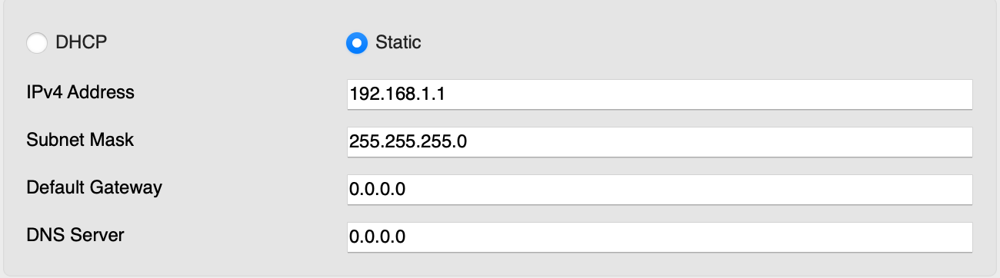

# VLAN

Cisco Switch VLAN Seting

## 題目


設定一個 VLAN 50 並設定 VLAN Name 為 cisco，並將 Fa0/1 加入到 VLAN 50 內</br>
Fa0/1 的 IP Address 為 192.168.1.1/24

## 設定

### 1. 設定 VLAN ID 和 VLAN Name

開啟 Switch CLI or Console 並輸入以下內容：</br>
<font color=red>(進入全域模式)</font>

```Cisco
Switch(config)#vlan 50            //設定 VLAN 50
Switch(config-vlan)#name cisco    //將 VLAN 50 名稱設為 cisco
```

### 2. 將 Fa0/1 加入到指定 VLAN

```Cisco
Switch(config)#int fa0/1          //指定 Fa0/1
Switch(config-if)#sw acc vl 50    //將端口加入到 VLAN 50
```

### 3. 設定 IP 和 Subnet Mask

開啟 PC0 並設定指定 IP and Subnet Mask



## 如何查看是否加入到 VLAN 50 ?

使用以下指令查看 VLAN：

- **特權模式**

```Cisco
Switch#sh vl br
```

- **全域模式**

```Cisco
Switch(config)#do sh vl br
```


這時候可以看到 VLAN 50 已成功命名為 cisco 並加入 Fa0/1 端口
