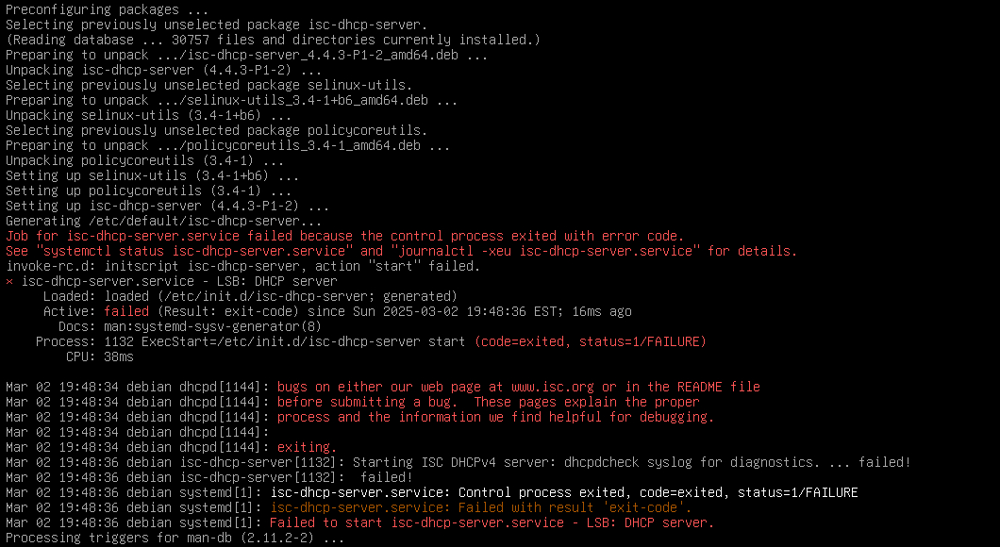
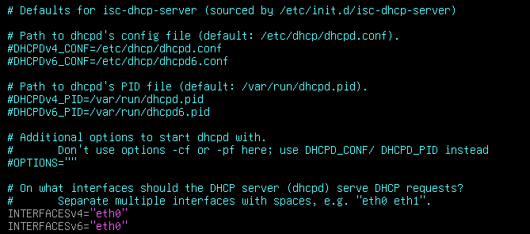
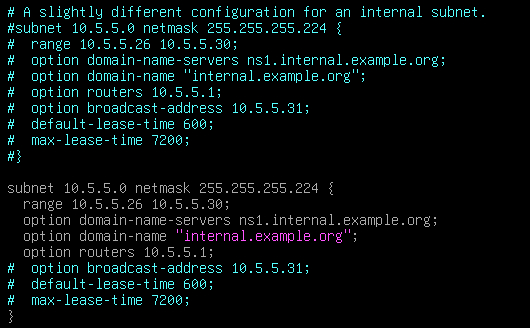
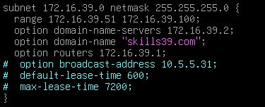
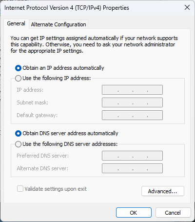
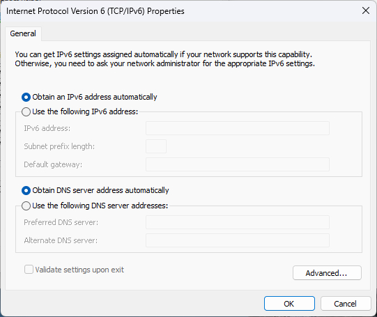

# DHCP

## DHCP-Server

### 1. 安裝 DHCP 套件

```bash
apt install isc-dhcp-server -y
```

安裝完成之後會跳出一些紅字，不管他，因為我們還沒配置。



### 2. 指定監聽的網卡

進到以下文件中

```bash
vi /etc/default/isc-dhcp-server
```

將需要的網卡輸入到 "" 中，如需 eth0 就輸入 eth0



- `INTERFACESv4` IPv4 DHCP 監聽
- `INTERFACESv6` IPv6 DHCP 監聽

儲存退出

### 3-1. 設定 DHCP (IPv4)

編輯 DHCP 設定檔 dhcpd.conf

```bash
vi /etc/dhcp/dhcpd.conf
```

往下移到第 50 行，然後將此段複製貼上到下面並解除需要的項目註解</br>
（注：最下面大括號前的註解也要解除！）



- `subnet 10.5.5.0 netmask 255.255.255.224 {`</br>
  分發的網段及遮罩
- `range 10.5.5.26 10.5.5.30;`</br>
  DHCP IP 分發範圍
- `option domain-name-servers ns1.internal.example.org;`</br>
  DNS Server
- `option domain-name "internal.example.org";`</br>
  網域名稱
- `option routers 10.5.5.1;`</br>
  預設閘道
- `option broadcast-address 10.5.5.31;`</br>
  廣播位置
- `default-lease-time 600;`</br>
  預設租約時間
- `max-lease-time 7200;`</br>
  最大租約時間

依照上方內容及需求更改



儲存退出後執行 `systemctl` 重啟服務

```bash
systemctl restart isc-dhcp-server
```

### 4. 測試

開啟客戶端做測試（以 Windows 11 做示範）</br>
進到網口設定，將 IPv4 和 IPv6 皆改為自動獲取



完成後查看詳細資訊，是否有成功分配到 IP 及其他資訊

## DHCP-Realy
