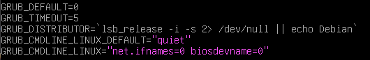
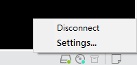
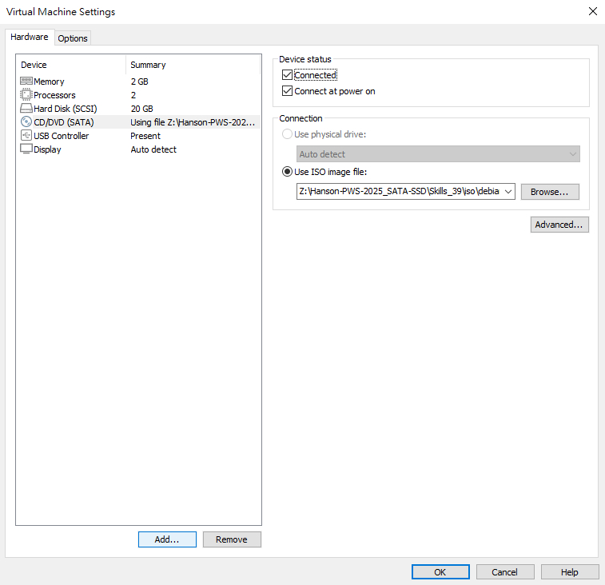
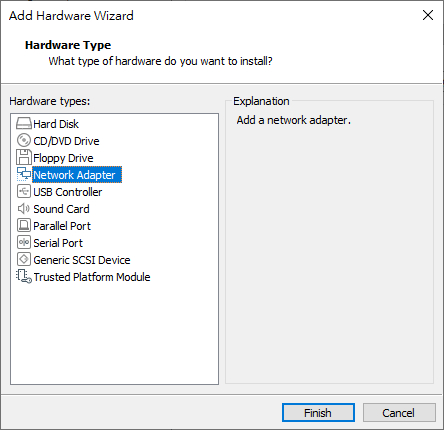
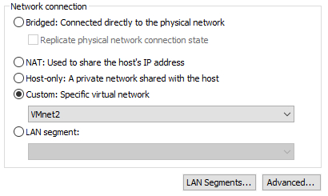
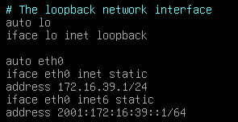
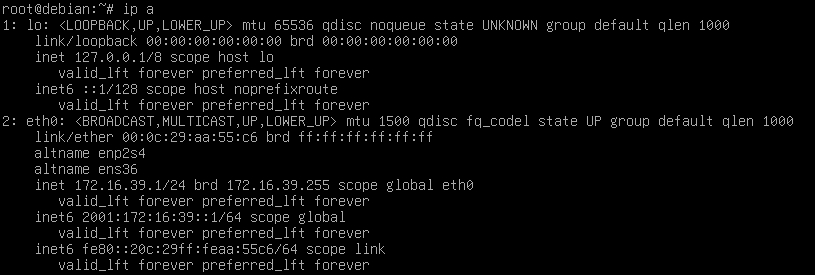
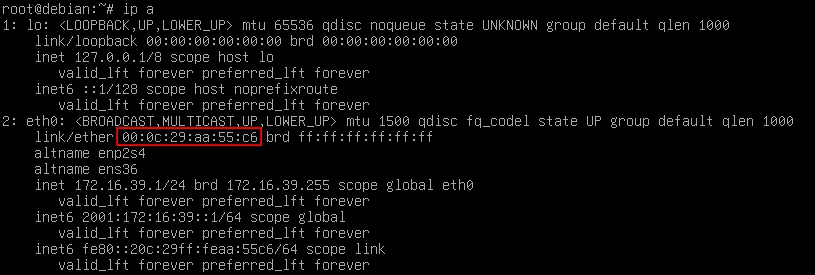
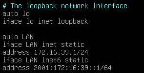
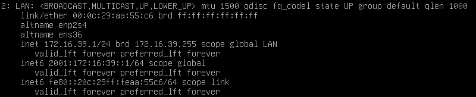

# Networking

## 基礎設置

### 1. 安裝 net-tools 套件

```bash
apt install net-tools -y
```

### 2. 更改 grub 設定

vi 進入 `/etc/default/grub` 中找到 `GRUB_CMDLINE_LINUX` 項目並添加以下內容

```bash
net.ifnames=0 biosdevname=0
```



更改完畢後按 ESC 輸入 `:wq` 退出並儲存</br>
接著輸入 `update-grub` 更新 grub 內容

### 3. 添加並設定網卡

接著開啟虛擬機設定並加入需要的網卡，螢幕右下角 CD 圖示按右鍵 Settings，選取 Hardware 項目底下的 Add...




選取 Network Adapter 按 Finish



選取需要的設定（一般都是選擇 Bridged，多網卡建議選擇 Custom），按 OK 退出 Settings



### 4. 設定網卡

vi 進入 `/etc/network/interfaces` 將預設網卡內容複製並貼到下方

- V - 選取
- Y - 複製
- P - 貼上

<video src="Files/Networking/網卡-選取複製貼上.mov" controls muted width=100%></video>

複製完畢後將下方剛剛複製的內容依照需求做更改

- lo -> 網卡名稱
- loopback -> 網卡類型（static,DHCP)
- inet -> IPv4 (inet) , IPv6 (inet6)

如需要使用手動設定 IP 請在下方加入 address 行列並新增需要的 IP and Mask，有預設閘道需求請在下方加入 gateway 行列並新增目標路由的 IP



更改完成後按 ESC 輸入 `:wq` 儲存並退出

### 5. 重啟服務並查看結果

如果你是第一次設定第二步的 grub 設定，直接 `reboot` 即可，but 你如果已經更改過 grub 且重啟過 VM，請輸入以下指令：

```bash
systemctl restart networking
```

重啟網卡設定即可，第一次設定 grub 因為要重新載入所以要重啟，如果設定過就不用在重啟系統了，時間很寶貴～

重啟完系統或服務後輸入 `ip a` 即可查看網卡資訊！



出現了剛才所設定的內容表示成功！

## 網卡名稱

先使用 `ip a` 來查詢需要更改名稱的網卡 MAC 位置



接著輸入以下指令

```bash
vi /etc/udev/rules.d/100-interfaces-name.rules
```

- `100` 為規則優先順序
- `interfaces-name` 可自訂名稱
- `.rules` 為規則副檔名


進入後依照下列格式及需求加入到文本中

```bash
ATTR{address}=="XX:XX:XX:XX:XX:XX", NAME="$NAME"
```


:輸入完後儲存退出

進入到 `/etc/network/interfaces` 中將網卡設定改成更改後的網卡名稱
ex. eth0 -> LAN



完成後儲存退出

更改完畢後 `reboot` 再輸入 `ip a` 查看是否更改成功！


