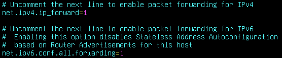
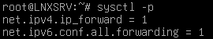

# Routing

### 1. 修改 sysctl 參數

進入 sysctl.conf 並輸入 27

```bash
vi /etc/sysctl.conf
```

游標會停留在 `net.ipv4.ip_forward=1` 前，將註解解除（按 Delete）</br>
再往下移到 `net.ipv6.conf.all.forwarding=1` 前，解註解



- `net.ipv4.ip_forward=1` 為 IPv4 的 forward
- `net.ipv6.conf.all.forwarding=1` 為 IPv6 的 forward

### 2. 查看結果

解除後按 ESC 輸入 `:wq` 儲存並退出，然後輸入 `sysctl -p` 查看結果


