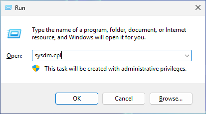
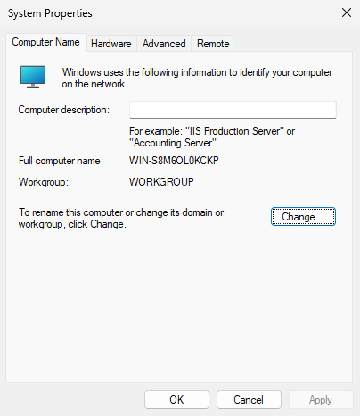
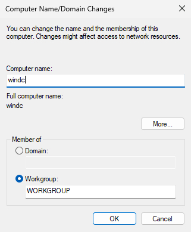
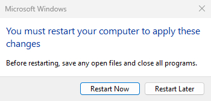
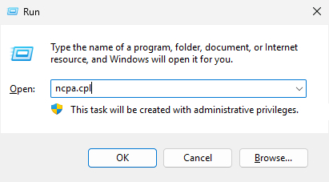
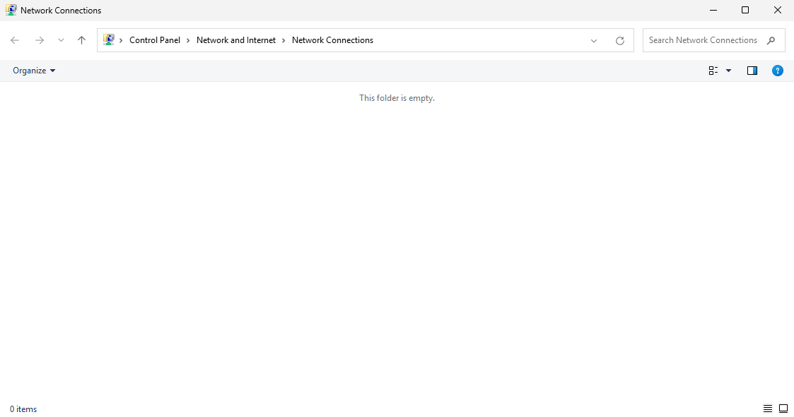
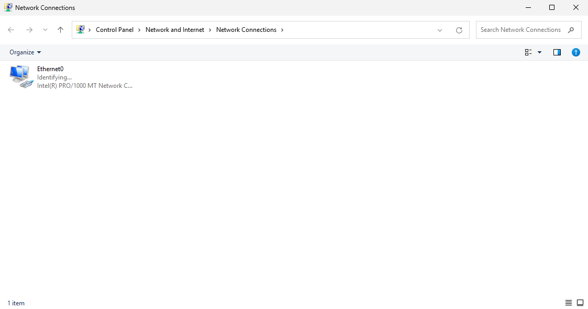
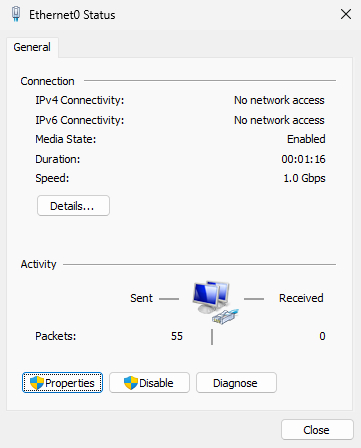
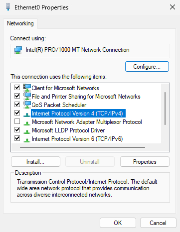
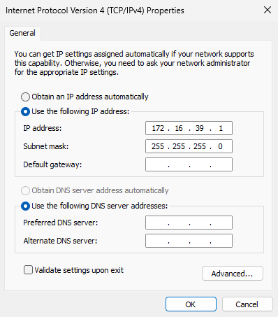

# 前置作業

### 更改主機名稱

Win + R 輸入 `sysdm.cpl`

點擊 Change...

將 Comprter name 更改成需要的主機名稱，按 OK（後面一路 OK）

這裡問你要不要重啟系統套用設定，先按 Restart Later 稍後重啟系統，先設定網卡

### 設定網卡

Win + R 輸入 `ncpa.cpl` 開啟網卡控制台

謝先生：疑？怎麼是空的？毛澤東💀 
沒事先不要慌，還記得前面 Debian 網卡那篇有加入網卡嗎，去 VMware 設定加入網卡就好了

加入好以後就會出現啦！這時候雙擊需要的網卡

點擊 Properties

雙擊 Internet Protocol Version 4 (TCP/IPv4)

然後依照需求做更改，完成後按 OK -> OK -> Close （一定要關閉不然設定會不見）

設定完成後在重啟系統即可！
